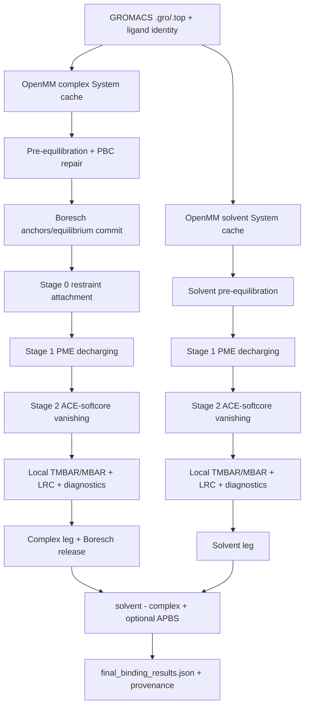

# ABFE-IBS 当前代码与新设计的工作原理

> 文档性质：论文 Methods/Discussion 级技术底稿。  
> 代码与证据快照：2026-08-12。  
> 当前生产协议：IBS bias v29、thermodynamic path v21、LJ LRC v3、WCA accounting v2、ESS gate v3。  
> 说明：历史 status/plan 文档可能停留在更早协议；本文件优先采用当前源码、sealed protocol 和最新 artifact。

## 1. 软件要计算什么

软件计算配体的绝对结合自由能。核心思想不是直接模拟“结合/解离事件”，而是构造一条可逆的 alchemical 路径：分别在蛋白口袋和水中逐步关闭配体与环境的相互作用，再用热力学循环相减。

当前符号为：

```text
Delta G_bind = Delta G_solvent - Delta G_complex + Delta G_APBS
```

其中每条腿定义为 `lambda: 1 -> 0` 的 coupled-to-decoupled 自由能。复合物腿包含 Boresch restraint attachment、受限解耦和标准态释放；溶剂腿没有 Boresch。APBS 是可选外部修正，默认不加。

## 2. 当前生产代码的总计算图



代码职责：`runabfe.py` 管 CLI/配置/体系与两腿；`abfe_pipeline.py` 管阶段状态机和恢复；`abfe_preoptimizer.py` 管 lambda 路径；`ibs_engine.py` 管 IBS、TMBAR/MBAR、Boresch attachment、LRC 和统计门；`abfe_core.py` 管 System、softcore、Boresch 解析项和热力学循环。

## 3. Alchemical Hamiltonian

### 3.1 dual-lambda 分解

默认路线用两个参数：

- `lambda_coul` 控制 ligand-environment electrostatics；
- `lambda_vdw` 控制 ligand-environment Lennard-Jones/softcore interaction。

抽象上可写为：

```text
U(x; lambda_coul, lambda_vdw)
  = U_common(x)
  + U_coul_soft(x; lambda_coul)
  + U_LJ_soft(x; lambda_vdw)
  + U_restraint(x; lambda_restraint)
```

`U_common` 包含在所有 lambda 态都相同的环境、配体内部和其它物理项；alchemical cross interaction 被单独构造，使 IBS 能在同一构型上查询多个目标态。

### 3.2 ACE softcore

当前 `ACESoftcorePotential` 使用无量纲、按 pair sigma 缩放的 Beutler alpha：

```text
sigma_ij = (sigma_i + sigma_j)/2

D_LJ = r^6 + alpha_LJ * sigma_ij^6 * (1-lambda_vdw)^m_LJ
D_C  = sqrt(r^2 + alpha_C * sigma_ij^2 * (1-lambda_coul)^m_C)

U_LJ = lambda_vdw^n_LJ * 4 epsilon_ij
       * [sigma_ij^12/D_LJ^2 - sigma_ij^6/D_LJ]

U_C  = lambda_coul^n_C * 138.935456 q_i q_j / D_C
```

默认 `alpha_LJ=0.5`、`alpha_C=0.2`、LJ powers `(m,n)=(2,2)`、Coulomb powers `(1,1)`。lambda=1 精确回到硬相互作用，lambda=0 精确归零。

这一“dimensionless_sigma_scaled_v2”约定非常重要。旧实现曾把 `alpha_LJ=0.5` 当成绝对 `nm^6`，对典型 `sigma≈0.3 nm` 相当于数百个 `sigma^6`，把软化变化压缩到 lambda 接近 1 的极窄区域，造成 Fisher metric 峰值和 window 0 overlap 人为恶化。alpha 约定已经进入协议指纹，旧 pilot、LRC 和能量缓存不能复用。

### 3.3 Stage 1 为什么默认使用 PME

OpenMM `CustomNonbondedForce` 不能提供完整 PME reciprocal-space electrostatics。把真实电荷放进 cutoff CustomNonbondedForce 会产生物理错误。因此默认 Stage 1 使用 `NonbondedForce` parameter offsets/传统状态采样，确保每个 lambda 态查询到完整 PME real + reciprocal + self energy。

历史上曾额外手工加入 `+C lambda^2` PME self correction；当前已经撤销，因为 OpenMM 在按 lambda 缩放实际电荷后本来就包含正确 Ewald self term，再加一次会重复计数。

## 4. Boresch restraint 的工作原理

### 4.1 为什么需要 restraint

当复合物中的 ligand 被逐步解耦后，它不再被口袋相互作用束缚。如果任其自由漂移，decoupled state 的平移/转动体积与标准态定义不一致，也会破坏可逆路径。Boresch restraint 用 1 个距离、2 个角和 3 个二面角定义 receptor-ligand 相对位姿。

### 4.2 Stage 0 attachment

软件先从无 restraint 到有 restraint 运行 `lambda_boresch_scale: 0 -> 1`：

```text
U_attach(lambda) = U_physical + lambda * U_Boresch
```

主估计量为相邻 BAR chain；TI 和 MBAR 用作交叉检查/诊断。attachment 不采用直接 Hamiltonian REMD，因为错误 anchor basin 交换可能产生极高能垒。

### 4.3 解析 release

在 ligand 已经与环境解耦后，Boresch restraint 的移除可以用简谐近似解析计算，并转换到 1 M 标准态。最终 complex leg 由：

```text
Delta G_complex
 = Delta G_attach
 + Delta G_decharge_restrained
 + Delta G_vanish_restrained
 + Delta G_standard_state_release
```

组成。

anchor selection 会检查成键关系、PBC unwrap、距离/角度几何、方差和谐振性；力常数近似为 `kBT/variance` 并裁剪到保守区间。坐标、anchor、equilibrium、force constants、schema 和 protocol 必须一起进入缓存身份，避免陈旧 Boresch 再次污染结果。

## 5. IBS 的工作原理

### 5.1 混合态偏置

一个 IBS window 同时表示 K 个 lambda 目标态。记第 k 态的可变相互作用能为 `U'_k(x)`，自由能偏置为 `f_k`：

```text
V_IBS(x) = -kT log sum_k exp[-beta (U'_k(x)-f_k)]
```

软件使用 max-pivot log-sum-exp 精确实现，避免直接指数溢出。OpenMM 中 `IBSBiasForce` 属于 force group 1。

给定当前构型，在混合分布下属于目标态 k 的条件权重为：

```text
p_k(x) = exp[-beta(U'_k-f_k)]
         / sum_j exp[-beta(U'_j-f_j)]
```

理想 `f_k` 约等于各物理态自由能 `F_k`（允许任意公共 gauge），从而抵消不同态的配分函数差异，使所有态都获得采样支持。

### 5.2 能量账本与 force groups

采样器区分：

- base physical energy；
- K 个目标态的 interaction/restraint energies；
- IBS mixture bias（group 1）；
- lambda-dependent WCA guard shell（group 4）；
- Python 侧解析 LJ LRC；
- 最终用于 TMBAR/MBAR 的 state energies。

WCA accounting v2 把 group 4 视为 sampling bias，而不是 lambda-independent base。所有 history 必须通过同一帧 finite gate 原子追加；某个分量失败时不能写 0，也不能让 energies/bias/base 的帧数错位。

### 5.3 v29 的 `f_k` 学习

warmup 每 250 MD steps 收集一帧，每 40 帧形成一个 minibatch。每批数据连同当时实际采样 bias 进入持久 TMBAR history。

TMBAR 试图从时变 bias 历史求出 absolute physical free-energy candidate：

```text
f_candidate ~= F, mean-centered
```

但 v29 只有在 raw overlap、raw absolute ESS、去相关样本、endpoint uncertainty 和 coverage ESS 同时通过可信门时才采用 absolute candidate。可信时：

```text
f_new = f_old + 0.10 * (f_candidate - f_old)
```

然后把一次实际应用更新的 pairwise span 硬限制在 2 kT。这里源码实际阻尼是 0.10；某些旧 docstring 仍写 0.20，应视为过期文本。

若 TMBAR 不可解或不可信，控制器使用受限占据反馈：

```text
Delta f_k = -eta kT log(K * <p_k>)
```

过度代表的态降低 `f_k`，欠代表态升高 `f_k`。中等残差使用较小 pairwise 半径；只有 residual>=70 的真塌陷才开放到 10 kT severe ceiling，但最终 Context 应用仍受 2 kT 总 cap。这个 fallback 是增量反馈，不是 absolute free-energy estimator。

### 5.4 什么时候冻结

学习阶段不是在追求无限精确的平坦占据，而是在找到一个足以进入固定 Hamiltonian 检查的 `f_k`。连续两批实际 pairwise update 不超过 1 kT 时，进入 freeze/burn-in。

冻结后把最近 5 个固定-`f_k` minibatch 拼成 local single-reference MBAR。唯一生产入口 loose gate 是：

```text
max_edges |Delta f_edge - Delta F_MBAR_edge| < 10 kJ/mol
```

它只阻止完全饿死的局部边，不要求 warmup 已达到最终统计精度。occupancy、coverage ESS 和 absolute ESS 此时主要用于诊断“平坦、统计薄或塌陷”，不是生产放行的附加严格门。

### 5.5 production immutability

一旦进入 production：

- `f_k` 只读；
- 禁止 `update_weights()`；
- production 从独立第 0 帧开始；
- warmup/validation frames 不混入结果；
- checkpoint 中保存 frozen `f_k`、protocol fingerprint、lambda/window identity 和采样状态。

这个边界把“适应性偏置学习”和“固定 Hamiltonian 正式统计”分开，是结果可解释性的关键。

## 6. Lambda v21 的工作原理

### 6.1 pilot Fisher metric

Stage 2 pilot 在每个 lambda 点估计：

```text
g(lambda) = beta^2 Var[dU/dlambda]
```

热力学长度为：

```text
s(lambda) = integral sqrt(g(lambda)) |d lambda|
```

纯热力学长度等分可能在 metric 异常尖锐时留下很大的几何 lambda 空洞。v21 把归一化热力学弧长和几何进度混合：

```text
u(lambda) = (1-beta_g) s_hat(lambda) + beta_g (1-lambda)
```

再对 u 等分并反解 lambda。几何 floor 权重给出最大 lambda gap 上界；当前最终路径固定 23 个 unique states。配置中的 17 指 conventional pilot/base input count，不是最终 unique state count。

### 6.2 window contract

23 个 lambda nodes 被划成多个小 IBS ensembles：

- 每条 lambda edge 恰好属于一个 ensemble；
- 相邻 ensembles 只共享一个 boundary node；
- 非相邻 ensembles 不共享 node；
- 共享 node 作为自由能 offset 拼接参考，但不重复计算 edge。

这比“窗口重叠多个 states”更容易避免重复 edge 和 covariance 账本歧义。

## 7. Stage 2 estimator

### 7.1 augmented local MBAR

对每个 IBS production window，row 0 表示实际 IBS mixture 分布，row 1..K 表示物理 lambda 目标态。数据先按最差目标态权重序列估计自相关并去相关，再构造数值稳定的 reduced potential matrix。

原始单参考权重包含 WCA/LRC 等对所有目标态相同的 common-mode 因子，会把 raw ESS 大幅压低，却不改变目标态之间的相对覆盖。ESS gate v3 因此区分：

- mixture coverage ESS：由 `p_k(x)` 衡量目标态相对覆盖，是受门指标；
- raw ESS/common-mode tax：继续报告，但不作为独立硬门；
- occupancy：一阶矩诊断，防止某态权重整体极小但归一化 ESS 看起来健康；
- endpoint covariance uncertainty：MBAR 协方差给出的窗口端点误差。

absolute ESS 已取消独立门，因为它与 `ESS ratio * N_decorrelated` 恒等，给两者分别设阈值只是在重复约束同一量。

### 7.2 covariance chain

各窗口按 lambda 顺序排列。窗口内部 MBAR 给出共享边界到新端点的 Delta G 和 covariance；软件沿 shared node 拼成全 Stage 2 曲线：

```text
F(lambda_j) = sum_over_segments Delta F_segment
Var[F(lambda_j)] = sum independent segment variances
```

最终检查 coverage 是否覆盖全部 lambda index、每个窗口是否收敛、mixture ESS ratio、去相关样本数和 endpoint sigma。split-half drift 是额外 stationarity 诊断，不自动替代正式 MBAR error。

## 8. LJ LRC 与 APBS

### 8.1 LJ tail correction

Custom softcore interaction-group 不会自动包含 cutoff 外均匀流体尾项。当前 dual-lambda 主线对真实 switching/softcore radial expression 数值积分，分别得到 `r^-6` 与 `r^-12` 系数，并按每帧盒体积加入目标态能量：

```text
U_k^corrected(x_n) = U_k^cutoff(x_n) + C_k / V(x_n)
```

因此 LRC 在 MBAR 之前进入每个 state energy，而不是在最终 Delta G 后加一个统一常数。membrane inhomogeneous 环境不满足均匀密度假设，默认不能复用 soluble LRC。

### 8.2 APBS/Rocklin

对于 charge-changing neutralizing-plasma 路线，`apbs_correction.py` 可准备 charge-masked PQR、统一 DX grid，并汇总 NET/USV/RIP/EMP/DSC 等有限尺寸静电修正。膜模式要求 dielectric maps 和 lipid charge map；只给一个 slab 常数不足。

co-alchemical ion 路线已经在 Hamiltonian 内保持总电荷，不应再叠加 Rocklin/APBS，否则会重复修正并 fail closed。

## 9. Resume 与 immutable rescue

每个缓存同时绑定输入 hash、System/topology、坐标/盒、protocol versions、lambda array、window ranges、Boresch、LRC/WCA/ESS、seed 和 checkpoint 平台。resume 不是“看到文件就跳过”，而是逐项验证身份。

生产质量不足时：

1. 保持 lambda、frozen `f_k` 和原文件不变；
2. 只对失败 window 追加 250k→500k→1M 累计预算；
3. 仍不足时，从已有 lambda nodes 建立新的 bridge rescue ensembles；
4. rescue 数据写入独立目录；
5. 离线 analyzer 显式拼接，不覆盖原 ensemble。

这使每一批样本都能对应唯一 Hamiltonian 和 protocol identity。

## 10. 新设计的共同接入抽象

大多数新设计都试图在不改变 IBS/MBAR 接口的前提下，为每个 lambda 态加入一个低成本路径项：

```text
U_new(x, lambda_k)
 = U_base(x, lambda_k)
 + sum_m A_km * B_m(x)
```

其中：

- `B_m(x)` 是构型依赖 basis/CV/teacher-student residual；
- `A_km` 是 lambda-dependent coefficient；
- 端点通常要求 `A(0)=A(1)=0`，避免改变物理端态；
- 新项必须同时进入 OpenMM sampling force、IBS state-energy query、TMBAR/MBAR ledger 和 protocol fingerprint；
- 最终评价不是只看离线 RMSE，而是 correctness + stability + cost + ESS/GPU-hour。

## 11. Outer-lambda neural basis

`OuterLambdaController` 的协议 v1 使用：

```text
w(lambda) = sin^2(pi lambda)
A_m(lambda) = w(lambda) c_m
U_path = sum_m A_m(lambda) B_m(x)
```

`w(0)=w(1)=0` 保证端点逐位归零；`c_m` 当前为常数并受最大绝对值限制。`NeuralBasisModelSpec` 冻结模型、原子选择、support domain、dtype/device 和 SHA-256。控制器还检查 OpenMM CustomCV 数量预算：每个 lambda 态已有 interaction/restraint CV，再加 M 个 shared bases，不能超过平台上限。

`IBSSamplerNeuralPathAdapter` 不修改主 `ibs_engine.py`，只替换能量收集：原 interaction energy 与 neural path energy 同步进入 state rows，同时保留 sampling bias、base 和 LRC。这个隔离设计用于证明账本闭合后再考虑 production merge。

预期收益：让一个共享昂贵 basis 在多个 lambda 态复用，只用便宜系数形成路径弯曲，从而提高相邻 overlap。风险：basis 计算成本、force correctness、端点、support-domain 外推和在线调用频率。

## 12. MACE teacher 与 LocalResidualStudent

### 12.1 Teacher

MACE/ORB teacher 是局部图神经网络：原子类型和坐标构图，经过等变 message passing 产生 node latent/energy。项目不直接把 teacher 的绝对能量当生产势，而是用冻结 teacher 产生离线 label/latent。

### 12.2 Student 目标

LocalResidualStudent 学习局部 residual 或相邻态 direct gap：

```text
y(x) = Delta E_teacher(x) - Delta E_base(x)
or
y_k(x) = U(x,lambda_{k+1}) - U(x,lambda_k)
```

模型用动态 ligand-environment cross edges、原子类型 embedding、Gaussian radial basis、quintic C2 cutoff、少量 interaction blocks 和 ligand-only invariant pooling，最后由 bounded scalar head 输出 dimensionless `basis_reduced`。

由于只依赖距离，能量对平移/旋转不变；通过 autograd：

```text
F_student = -grad_x E_student
```

可得到坐标等变力。动态环境 membership 由每帧邻居决定，不冻结一个跨轨迹巨大候选池。

训练按 whole-run leave-one-run-out，避免随机 frame split 泄漏时间相关信息。离线 gap-variance 改善只是 D1；D2 还要坐标 finite difference/autograd、PBC、力、端点和 support checks；D3 才是 OpenMM parity/cost；D4 才是短动力学与 ESS/GPU-hour。

## 13. TorchForce 与三种 MTS/部署设计

### 13.1 直接每步 TorchForce

TorchScript 模型作为 OpenMM TorchForce，每个积分步计算 `E(x)` 和反向力。优点是 Hamiltonian 清楚；缺点是 Python/Torch graph、neighbor list 和 backward 成本可能远大于基础 MD。

### 13.2 whole fused Group-1

把 classical interaction 与 student 路径合成一个 sampled Group-1 Hamiltonian，理论上账本最直接，但必须确保 target rows 与实际 force 完全一致。

### 13.3 independent additive student

保留 classical base force，另挂 additive student force：

```text
U_sample = U_classical + c * U_student
```

它是一个新的 sampling Hamiltonian，不能把 fused 设计中的 ESS proxy 直接迁移过来。

### 13.4 MTS/rRESPA

把便宜 base 放 fast group，每步更新；昂贵 student 放 slow group，每 N 个 inner steps 更新一次。它假定 slow force 在 N*dt 内变化足够缓慢。即使 N=1 parity 通过，也必须测试 N=2/4/8... 的温度、能量、constraint、force distribution 和跨 seed systematic shift。

当前结论：这些路线均未获得 production promotion。失败原因分别涉及 CUDA backend、成本、N-dependent shift 或 N=1 ESS signal，而不是一个统一的“神经势无效”。

## 14. DEXP

DEXP 用 pair-specific 双指数径向核替代 LJ 的固定 12-6 形状。参数通过约束井深、平衡距离和零斜率，使势在参考点与 LJ 对齐，同时改变近程排斥和远程衰减的形状：

```text
U_DEXP(r) = A exp[-alpha (r/r0-1)]
            - B exp[-beta (r/r0-1)]
```

实际系数由匹配条件确定，力为 `-dU/dr`。若接入 IBS，应在 pair force 层替换 state interaction kernel，lambda 仍只控制 coupling，MBAR state graph 不变。

DEXP 的资格不能只看 energy RMSE，还要 force、torque、Hessian、PBC、环境截断、跨初态动力学和跨体系 transfer。当前单 Atenolol kernel projection 有正结果，但多初态未平衡，merge proposal 未进入生产。

## 15. Shadow-Coulomb IBS

完整 PME energy 不能作为 CustomNonbondedForce CV。Shadow route 用 Ewald real-space 形式：

```text
U_shadow(r) proportional to erfc(alpha_Ewald r)/r
```

构造可放入 IBS 的短程 Coulomb states，再用独立 bridge leg 把真实 PME 满电荷端点连接到 shadow 满电荷端点：

```text
Delta G_decharge
 = Delta G_bridge(real PME -> shadow)
 + Delta G_IBS(shadow charged -> neutral)
```

这种设计保持长程物理端点，但引入额外 bridge estimator 和模型误差门。目前 neutral-ligand only、实验性，未获独立生产验证。

## 16. Co-alchemical charge transfer

带净电 ligand 在 PME 下直接改变总盒电荷会引入有限尺寸/neutralizing plasma 问题。co-alchemical route 选择并冻结一个 bulk counterion，使：

```text
q_ligand(lambda) = lambda q_ligand_full
q_coion(lambda)   = q_coion_initial + (1-lambda) q_transfer
```

整个 lambda 路径总电荷恒定。co-ion identity、restraint anchor、bulk geometry 和两腿协议必须一致；single-atom co-ion 避免内部自由度。该路线与 Rocklin/APBS 二选一。

局部 mixed-force/normalization 门已修复并通过，但尚缺真实 charged ligand complex+solvent 全循环，因此仍是 experimental end-to-end status。

## 17. Membrane 设计

膜体系与 soluble 最大区别不是“多一些脂质”，而是统计力学边界条件改变：

- 使用 `MonteCarloMembraneBarostat`，z 为膜法向；
- xy 可等比例/各向异性缩放，z 可 free/fixed/constant-volume；
- 需要 area-per-lipid、膜厚、leaflet、water/ion penetration 和 pose 稳定性质量门；
- uniform-density LJ LRC 对非均匀膜不成立；
- CHARMM force-switch 与 OpenMM switching 实现不完全等价，需要 deviation evidence；
- APBS 需要空间 dielectric/lipid charge maps。

膜预平衡质量门通过不等于 ABFE Stage 0/1/2 通过。当前完整膜 ABFE 尚未闭合。

## 18. EXP-017 overlap-first

该设计不先假设“应该插 lambda”，而是用只读 ledger 先定位问题：

1. 计算现有 window 的 local TMBAR/MBAR overlap、ESS、去相关样本；
2. 做 split-half stationarity；
3. 只有出现 localized bad edge 时才允许 fixed-lambda bidirectional probe；
4. probe 确认边宽问题后才授权 lambda-only P1；
5. 只有 lambda-only 不能解释时才考虑 analytic-q P2。

这套顺序防止把时间漂移误诊为 lambda spacing。实际 EXP-017 没有 localized edge，因此正确动作是不插 lambda。

## 19. EXP-020 SoftLift

SoftLift 的科学目标是：保留 LocalResidual/teacher 的慢局部信息，但把全图神经网络压缩为 ligand-anchored、严格局部、旋转/平移不变的解析/小模型。

输入是每帧 ligand-environment ragged edges。R1 用单 density channel；R2/R3 增加 typed pair/context 和规范化方向矩。模型只输出 reduced scalar basis，不自己乘 beta、lambda coefficient 或构建 neighbor list，这些职责与 OuterLambdaController 分开。

设计强调：

- exact no-contact zero；
- strict cutoff membership；
- PBC minimum image；
- maximum environment/edges/neighbors fail closed；
- bounded output；
- offline reference、native OpenMM 和 Torch deployment 三者 parity。

R1 离线信号通过，但 N0/N1/N2 不同部署图的实际成本均超过预算，说明“模型参数少”不等于“OpenMM 执行便宜”。

## 20. EXP-021 GroupedDensityCV

### 20.1 当前权威状态

`protocols/EXP-021_preregistration.json` 已 `SEALED`，旧 plan 中 `DRAFT_NOT_SEALED` 已过期。G1 D0-COST 已执行：

```text
qualification median ratio       1.107419
bootstrap 95% upper ratio        1.114105
limits                            1.07 / 1.10
conclusion                        STOP_EXP021_NATIVE_DENSITY
training authorized              false
G2/G4 authorized                 false
```

### 20.2 数学结构

G1/G2/G4 分别把 ligand 原子分为：全部一组、H/重原子两组、H/C/N/O 最多四组。对每个 ligand group g、environment element type t 和 16 个 radial centers p：

```text
q_g(x) = (q0/|g|) sum_{i in g} sum_{j in env}
         C2(r_ij) sum_{t,p} 1[Z_j=t] w_g,t,p
         exp[-(r_ij-mu_p)^2/(2 sigma_r^2)]
```

再归一化 `x_g=q_g/q_norm,g`，使用 8-unit bounded analytic readout：

```text
rho_g(x_g) = sum_h v_g,h tanh(a_g,h x_g + c_g,h)
B(x) = Bmax tanh((sum_g[rho_g(x_g)-rho_g(0)]-b0)/Bmax) - constant
```

无接触时输出精确 0，外层 lambda coefficient 由现有 OuterLambdaController 只应用一次。

### 20.3 Native OpenMM 图

每个 group 用一个 `CustomNonbondedForce` interaction group 计算动态 ligand-environment density；这些 child forces 由一个 `CustomCVForce` 持有，再做 tanh readout。环境不是冻结候选池，而是 OpenMM neighbor-list 中 cutoff 内的动态成员。

D0 skeleton 已包含最终形状的 16 radial × 7 environment types × 8 tanh units 和非零确定性参数，因此成本失败不能靠“以后训练后会更快”解释。按照 sealed stop rule，G1 失败即停止整个 native-density EXP-021，不训练 G1，也不继续更复杂的 G2/G4。

## 21. 为什么新设计普遍设置 cost-first gate

在普通 MD baseline 约 0.3–1.3 ms/step 时，即使一个模型离线只需几十毫秒，也会使总成本增加数十倍。一个增强势若把 ESS 提高 20%，但每步成本增加 80%，ESS/GPU-hour 仍下降。

因此最终效用应写为：

```text
utility = effective independent samples / GPU hour
```

而不是只报告：RMSE、R2、gap variance 或 raw ESS。Cost-first skeleton 在训练前测最终 OpenMM calculation graph 的不可消除下界；过不了就停止，避免投入训练后才发现部署不可行。

## 22. 当前设计状态对照

| 设计 | 核心作用 | 当前状态 |
|---|---|---|
| ACE dual-lambda softcore | 默认 alchemical Hamiltonian | 当前生产主线 |
| PME decharging | 完整长程静电去电荷 | 当前推荐 Stage 1 |
| IBS v29 | 多 lambda mixture sampling | 已实现；端到端统计仍需闭合 |
| v21 metric path | Fisher+geometry lambda placement | 当前路径 |
| Boresch BAR+analytic release | pose/标准态处理 | 已实现 |
| Local TMBAR covariance chain | Stage 2 estimator | 已实现 |
| immutable rescue | 非变异恢复 | 已实现，需当前协议复核 |
| DEXP | 解析 pair-kernel 替代 | 单体系研究；未进生产 |
| Shadow IBS | PME-shadow bridge + IBS | 实验性 |
| co-alchemical ion | 恒总电荷去电荷 | 局部门通过；全循环待验 |
| Outer-lambda neural basis | 共享 basis 弯曲 lambda path | 独立模块；无 production promotion |
| MACE/LocalResidual | teacher/student residual | 离线信号；在线未晋级 |
| TorchForce/MTS | 低频昂贵 force | 已停止当前路线 |
| ORB | 离线表示/teacher | cost gate failed，teacher-only |
| EXP-017 overlap-first | 先诊断再插 lambda | completed，未授权插点 |
| EXP-020 SoftLift | 局部解析/小模型压缩 | 离线资格；native cost failed |
| EXP-021 GroupedDensity | native grouped density | sealed；G1 D0 cost failed，整体停止 |
| membrane | 膜 barostat/质量门/色散边界 | pre-equil 通过；完整 ABFE 待验 |

## 23. 写论文时最重要的机理结论

1. IBS 的关键不是让 raw occupancy 完美平坦，而是学习一个足够可信的固定 `f_k`，随后在不可变 Hamiltonian 下采 production。
2. lambda overlap、stationarity、MBAR covariance 和跨 seed variance 是不同问题；局部 overlap 健康不能证明 endpoint uncertainty 已闭合。
3. neural/analytic basis 的离线 gap-variance 改善不能自动推出在线 ESS/GPU-hour 改善。
4. MTS 正确性必须研究时间尺度和 N-dependent bias，不能只做 N=1 parity。
5. 原地自动改 lambda/f_k 会破坏 ensemble identity；immutable rescue 更容易审计。
6. 对 GPU MD，部署计算图和 neighbor-list 开销常比模型参数量更决定性能，因此 cost-first gate 是科学验收的一部分。

## 24. 代码索引

| 原理 | 关键实现 |
|---|---|
| ACE softcore | `abfe_core.py::ACESoftcorePotential` |
| Boresch selection/release | `abfe_core.py`, `ibs_engine.py::run_boresch_attachment_leg` |
| IBS log-sum-exp | `ibs_engine.py::IBSBiasForce` |
| v29 f_k update | `ibs_engine.py::IBSSampler.update_weights` |
| local freeze gate | `ibs_engine.py::IBSWindowManagerDualLambda.run_all_windows` |
| ESS v3/TMBAR | `ibs_engine.py::_ibs_reweighting_quality_diagnostics`, `GlobalMBARAnalyzer` |
| lambda v21 | `abfe_preoptimizer.py::blended_metric_vanishing_lambdas` |
| pipeline/rescue | `abfe_pipeline.py::run_full_pipeline` |
| APBS | `apbs_correction.py` |
| outer lambda | `outer_lambda_neural_basis.py::OuterLambdaController` |
| neural ledger adapter | `outer_lambda_neural_basis.py::IBSSamplerNeuralPathAdapter` |
| LocalResidualStudent | `local_residual/student.py` |
| SoftLift | `local_residual/softlift.py` |
| GroupedDensity reference | `local_residual/grouped_density_cv.py` |
| GroupedDensity native | `local_residual/grouped_density_openmm.py` |
| EXP-021 sealed protocol | `protocols/EXP-021_preregistration.json` |

