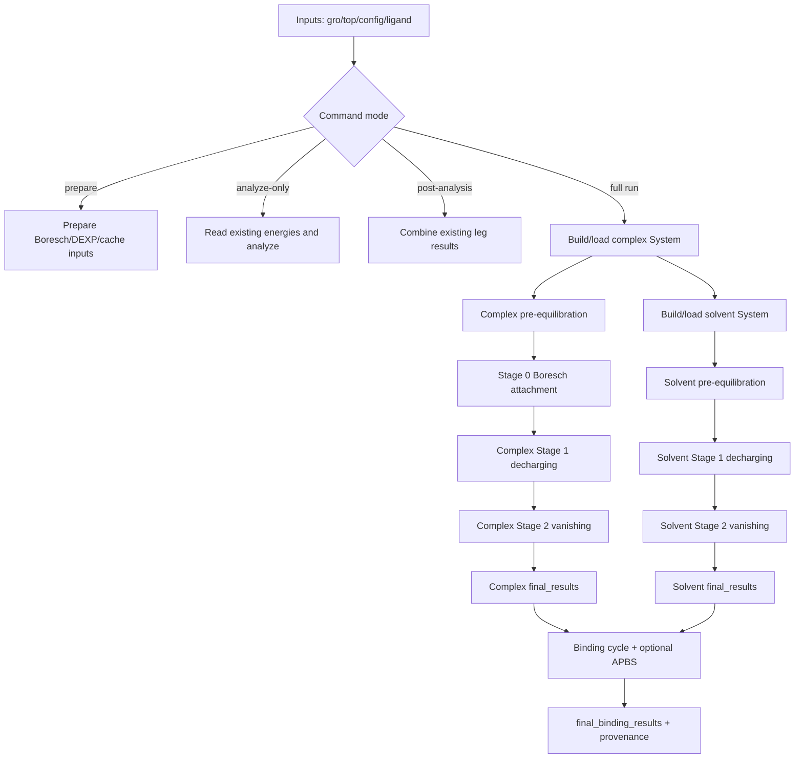
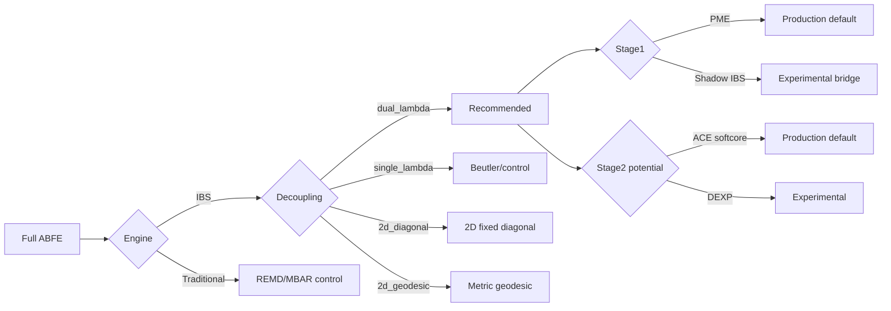
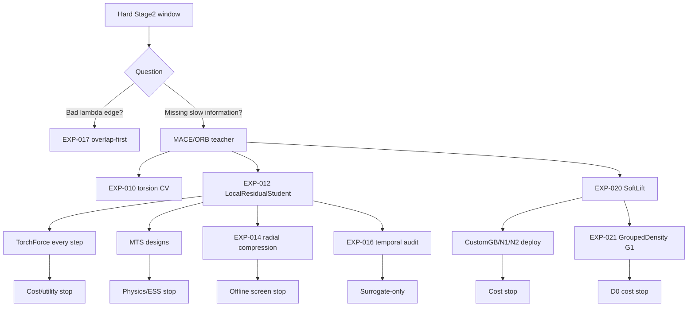

# ABFE-IBS 整体 Pipeline 与方法全景

> 目的：回答“软件从哪里进、经过哪些阶段、到底有多少种方法、哪些能组合、哪些只是实验、哪些已经停止”。  
> 快照日期：2026-08-12。  
> 方法数量取决于计数口径；本文件分别给出 CLI 选择轴、科学方法族和状态，不把所有笛卡尔积冒充有效路线。

## 1. 一句话总览

当前唯一推荐的生产基线是：

```text
IBS mode
+ dual_lambda
+ Stage 1 PME decharging
+ Stage 2 ACE softcore vanishing
+ Boresch simple/fluctuation for complex leg
+ soluble uniform-density analytic LJ LRC
+ non-mutating resume/rescue
+ Local-TMBAR covariance-chain analysis
```

其它选项分为：传统对照、实验 Hamiltonian、体系扩展、外部修正、独立研究模型和只读诊断。CLI 能选到不等于已获得 production qualification。

## 2. 顶层 pipeline



Stage 1 和 Stage 2 当前串行执行。历史 `parallel-stages` 代码已移除/不可作为推荐路径。

## 3. 方法到底怎么数

### 3.1 CLI 公开的主要选择轴

| 选择轴 | 数量 | 选项 |
|---|---:|---|
| 采样 engine | 2 | `ibs`, `traditional` |
| decoupling scheme | 4 | `dual_lambda`, `single_lambda`, `2d_diagonal`, `2d_geodesic` |
| pair potential | 2 | `softcore`, `dexp` |
| dual-lambda Stage 1 | 2 | `pme`, `shadow_ibs` |
| Boresch source | 6 | `traditional`, `orb_ml`, `simple`, `orb_simple`, `auto`, `fluctuation` |
| sampling preset | 3 | `test`, `production`, `high_accuracy` |
| platform | 3 | `CUDA`, `OpenCL`, `CPU` |
| environment type | 2 | `soluble`, `membrane` |
| charge treatment | 4 | neutral, co-alchemical transfer, Rocklin/APBS plasma, co-annihilation experimental |
| dispersion protocol | 5 | legacy LRC, native isotropic LRC, force-switch/no-LRC, LJ-PME, membrane-inhomogeneous |
| force-field family | 2 | Amber, CHARMM |

若机械相乘，前六个轴就有 `2×4×2×2×6×3 = 576` 种表面组合；加上环境、charge、dispersion 等会变成数万种。但绝大多数不是合法或有意义的组合。因此不能说软件有几千种“方法”。

### 3.2 更合理的科学方法族计数

按“改变核心物理或 estimator 的方法族”计数，当前可辨认约 **18 个方法族**：

1. 默认 dual-lambda ACE/IBS；
2. traditional REMD/single-lambda；
3. 2D diagonal path；
4. 2D geodesic path；
5. PME decharging；
6. Shadow-Coulomb IBS + bridge；
7. ACE softcore；
8. Beutler softcore；
9. DEXP pair kernel；
10. Boresch sampled attachment + analytic release；
11. co-alchemical charge transfer；
12. Rocklin/APBS neutralizing-plasma correction；
13. soluble analytic LJ LRC；
14. membrane barostat/quality/dispersion branch；
15. outer-lambda neural basis；
16. MACE/LocalResidual/TorchForce/MTS family；
17. SoftLift/ORB/local analytic compression family；
18. overlap-first/grouped-density diagnostics and CV family。

这里的“18”是便于报告的分类，不表示 18 条都可生产使用。

### 3.3 当前生产、实验和停止状态

| 状态 | 方法数（族级粗计） | 说明 |
|---|---:|---|
| 当前主线/已实现核心 | 6 | dual-lambda、PME Stage1、ACE Stage2、Boresch、IBS/TMBAR、soluble LRC |
| 可选对照/部分实现 | 4 | traditional、single lambda、2D diagonal、2D geodesic |
| 实验性/端到端待验 | 4 | shadow IBS、charge transfer、membrane/APBS、DEXP |
| 独立研究且未晋级 | 4 | outer neural、MACE/MTS、ORB/SoftLift、grouped density |

## 4. 主线分支图



## 5. Stage-by-stage 方法表

### 5.1 输入和 System 构建

| 方法/功能 | 作用 | 状态 |
|---|---|---|
| GROMACS `.gro/.top` direct build | 构建 OpenMM System | 主线 |
| cached XML/CIF reload | 避免重复构建 | 主线 |
| ligand XML extraction | 生成/加载 ligand parameters | 主线工具 |
| soluble solvent builder | explicit water + salt | 主线 |
| membrane input declaration | 冻结 build provenance/composition | 已实现接口 |
| reserved co-ion dummy builder | charge-transfer 两腿准备 | 已实现，真实全循环待验 |

### 5.2 预平衡和 restraint

| 方法 | 作用 | 状态 |
|---|---|---|
| standard soluble barostat | 水溶体系 NPT | 主线 |
| membrane barostat | xy/z 专用缩放 | 膜扩展 |
| Boresch simple/fluctuation | 从几何涨落选 anchor/force constants | 当前推荐 |
| traditional Boresch | 读外部 anchor 文件 | 可选 |
| `orb_ml` | 读 ORB/ML 预测参数 | 可选输入 |
| `orb_simple` | ORB/MACE 单候选力投影 | 实验性 |
| `auto` | ORB/MACE 多候选枚举 | 实验性 |

六个 Boresch source 并不是六种热力学循环；它们只是生成同一 Boresch Hamiltonian 参数的六种来源。

### 5.3 Stage 0

| 方法 | 主估计量 | 状态 |
|---|---|---|
| sequential Boresch attachment | adjacent BAR | 主线 complex leg |
| TI crosscheck | reweighted finite-difference TI | 交叉检查 |
| MBAR | diagnostic | 非主值 |

### 5.4 Stage 1 decharging

| 方法 | 原理 | 状态 |
|---|---|---|
| PME offsets + REMD/BAR/MBAR | 完整 reciprocal/self/real PME | 当前推荐 |
| Shadow-Coulomb IBS | real-space shadow CV + PME-shadow bridge | 实验性、neutral only |
| co-alchemical transfer | ligand charge 转移到 frozen counterion | charged route，端到端待验 |
| plasma + APBS | 允许总电荷变化，后处理有限尺寸修正 | 独立路线，不能与 co-ion 同用 |
| co-annihilation | 实验对照 | 非生产，膜禁用 |

### 5.5 Stage 2 vanishing

| 方法 | Hamiltonian | 状态 |
|---|---|---|
| ACE softcore | dimensionless sigma-scaled softcore | 当前默认 |
| Beutler softcore | traditional interaction-group softcore | 对照/legacy |
| DEXP | double-exponential pair kernel | 实验性 |
| charge-transfer static handoff | 将 lambda_coul=0 烘焙成 fixed NB | 已接 seam；真实 charged run 待验 |
| WCA shield | lambda-dependent sampling guard | 当前 IBS 内部 |

### 5.6 采样与统计

| 方法 | 用途 | 状态 |
|---|---|---|
| IBS log-sum-exp | 一个 ensemble 覆盖多 lambda states | 主线 Stage2 |
| time-dependent MBAR | warmup 时变 bias history | 主线 |
| local augmented MBAR | 固定-f window estimator | 主线 |
| covariance-chain stitching | 共享 boundary node 拼全路径 | 主线 |
| mixture coverage ESS | 相对 state coverage | 主线质量门 |
| split-half drift | stationarity diagnosis | 只读诊断 |
| fixed-H bidirectional probe | 确认某条 lambda edge | 受控诊断 |
| immutable rescue | 新 ensemble 补 coverage | 主线恢复策略 |

## 6. Decoupling scheme 的四种含义

### 6.1 `dual_lambda`

先 decharge，再 vanish；可分别为 electrostatics 和 VDW 设计状态数与 estimator。它使问题容易诊断，是当前主线。

### 6.2 `single_lambda`

一个 lambda 同时控制 Coulomb/VDW 或沿固定一维 Beutler path 变化。优点是简单、易作 traditional control；缺点是难以独立优化 electrostatic 和 steric bottleneck，当前 LRC/固定盒条件也更严格。

### 6.3 `2d_diagonal`

在 `(lambda_coul, lambda_vdw)` 平面沿预定 diagonal path 走，仍是一条一维序列，但两个坐标同步变化。可用于比较 sequential dual-lambda 是否产生路径特定问题。

### 6.4 `2d_geodesic`

先测二维 metric tensor，再用 monotonic Dijkstra/geodesic 选择低热力学长度路径。理论上减少高方差区，但 pilot 成本高、cache/provenance 更复杂，目前不是默认生产路线。

## 7. Potential 的三层概念

不要把 CLI 的 2 个 `--potential` 选项和软件中所有势混为一谈：

1. CLI pair potential：`softcore` 或 `dexp`；
2. softcore 内部实现：ACE 或 traditional Beutler；
3. additive path basis：neural/LocalResidual/SoftLift/GroupedDensity，它们不是替代整个 base potential，而是在 base Hamiltonian 上加 lambda-dependent residual。

因此新模型的统一形式是：

```text
U_total = U_base_pair_potential + A(lambda) * B(x)
```

而不是把 OpenMM 全部力场替换成神经网络。

## 8. 新设计谱系



### 8.1 Outer-lambda family

| 子方法 | 表示 | 当前结论 |
|---|---|---|
| shared neural basis | `sum A_km B_m(x)` | 独立 harness，无 production wiring |
| MACE teacher | 等变 graph latent/energy | offline teacher |
| LocalResidualStudent | typed radial local residual | offline signal，未晋级 |
| TorchForce | per-step autograd energy/force | 成本过高 |
| MTS design 1/2/3 | fast/slow force split | 当前路线停止 |
| ORB layer-2 | graph representation | promising offline，online cost failed |

### 8.2 Analytic/compression family

| 子方法 | 核心计算 | 当前结论 |
|---|---|---|
| torsion Fourier CV | periodic low-dimensional PMF | EXP-010/011 未晋级 |
| typed radial compression | pair type × radial RBF | EXP-014 screen failed |
| SoftLift R1 | ligand-anchored single density channel | offline qualified, deploy cost failed |
| SoftLift R2/R3 | typed context/directional invariants | cost ladder stopped |
| full-system CustomGB | all-pair density floor | 1.6965× cost stop |
| GroupedDensity G1 | all ligand atoms one group | D0 median 1.1074, upper 1.1141, stopped |
| GroupedDensity G2/G4 | 2/4 element groups | blocked by G1 stop rule |

### 8.3 DEXP family

| 方法 | 目标 | 当前结论 |
|---|---|---|
| 12/6 kernel | LJ-like reference exponent | multi-initial-state not equilibrated |
| 14/5 kernel | fitted Atenolol candidate | kernel projection positive, dynamics not converged |
| MACE projection benchmark | compare analytic languages | single-system positive evidence |
| production merge | replace pair force in main pipeline | not qualified |

## 9. Environment/charge/dispersion 三个正交轴

### 9.1 Environment

`soluble` 与 `membrane` 改变 barostat、质量门和色散假设，不改变 complex/solvent 热力学循环的代数符号。

### 9.2 Charge treatment

四种 charge treatment 互斥：

- neutral：无需净电有限尺寸修正；
- co-alchemical transfer：Hamiltonian 内恒总电荷；
- Rocklin/APBS plasma：允许净电改变，循环外修正；
- co-annihilation：实验对照。

### 9.3 Dispersion

- `legacy_uniform_density_lrc`：当前 soluble ACE 主线；
- `ff_native_isotropic_lrc`：依赖 force field/native behavior；
- `ff_native_force_switch_no_lrc`：主要为 CHARMM deviation branch；
- `lj_pme`：接口存在但路线未完成；
- `membrane_inhomogeneous`：科学需要明确，但当前未实现。

membrane 不能静默使用 uniform-density LRC。

## 10. 合法组合与典型非法组合

### 10.1 推荐组合

```text
mode=ibs
decoupling=dual_lambda
potential=softcore
decharge_method=pme
system_type=soluble
charge_treatment=neutral
dispersion_protocol=legacy_uniform_density_lrc
boresch_source=simple
```

### 10.2 合法但实验性

- dual-lambda + shadow IBS + neutral ligand；
- dual-lambda + co-alchemical charge transfer + charged ligand；
- membrane + explicit membrane input + membrane barostat + approved dispersion evidence；
- DEXP parameter file + isolated experiment；
- neural/SoftLift/GroupedDensity independent qualification harness。

### 10.3 非法或会 fail closed

- custom IBS Coulomb CV 承载真实 PME charge；
- co-alchemical charge transfer 与 Rocklin/APBS 同时使用；
- charged ligand 走 neutral-only shadow IBS；
- membrane 使用 soluble uniform-density LRC；
- `lj_pme`/`membrane_inhomogeneous` 被当作已经实现；
- production 期间移动 lambda 或更新 frozen `f_k`；
- 用旧 protocol cache 恢复到新 Hamiltonian；
- 把 neural independent harness 当作 `runabfe.py` 已接线；
- EXP-021 G1 cost failed 后继续训练 G1 或运行 G2/G4。

## 11. Preset 不是科学方法

三个 preset 只改变预算：

| Preset | steps/window | Stage1 base states | Stage2 pilot/base states |
|---|---:|---:|---:|
| test | 10,000 | 12 | 17 |
| production | 250,000 | 12 | 17 |
| high_accuracy | 500,000 | 24 | 17 |

Stage2 的 17 是 pilot/base count；v21 最终 production path 是 23 unique lambda states。preset 不能替代独立重复和不确定度闭合。

## 12. Pipeline 输出层级

```text
run root/
├── system_native.xml / topology.cif
├── run_provenance.json
├── boresch_*.json
├── pre_equilibration.dcd
├── checkpoints/
│   ├── pipeline_state.json
│   ├── stage0_attachment.json
│   ├── stage1_decharging.json
│   ├── stage2_vanishing.json
│   └── ibs_state_*.json / openmm.chk
├── decharging/
├── vanishing/
├── vanishing_rescue/<plan_id>/
├── final_results.json
├── solvent_leg/
│   └── ... same leg-level structure
└── final_binding_results.json
```

实验方法使用独立 `output/outer_lambda_expXXX*` 目录和 sealed protocol/report hash，不能与主 ABFE run root 随意拼接。

## 13. 当前状态矩阵

| 方法 | Code | Static/unit evidence | Real GPU evidence | Production eligible |
|---|---|---|---|---|
| dual-lambda ACE/IBS | yes | yes | partial/candidate | not final-validated |
| PME Stage1 | yes | yes | historical/candidate | recommended, current-v2 reanalysis pending |
| Boresch | yes | yes | yes, old bug fixed | yes with identity/harmonicity caveats |
| soluble LRC v3 | yes | yes | candidate | default soluble only |
| traditional REMD | yes | yes | historical pass | V-02 pending |
| single lambda | yes | partial | partial | control only |
| 2D diagonal/geodesic | yes | partial | insufficient | not default |
| DEXP | yes | extensive experimental | single-system | no |
| shadow IBS | yes | contracts | insufficient | no |
| charge transfer | yes | CPU seam tests | no charged full cycle | no |
| membrane | yes | quality logic | 100 ns pre-equil | no full ABFE |
| APBS | helper yes | tool checks | current artifact disabled | no closed membrane cycle |
| outer neural | harness yes | extensive | experimental | no |
| LocalResidual/MTS | yes | D1-D4 evidence | yes | stopped/no promotion |
| ORB | yes | parity/representation | matched CUDA cost | teacher-only |
| EXP-017 | analysis yes | yes | read-only data | diagnostic only |
| SoftLift | yes | yes | cost probes | no |
| GroupedDensity G1 | yes | sealed/validated report | RTX 5080 D0 | stopped |

## 14. “有多少种方法”的报告写法建议

最稳妥的表述是：

> 软件公开 11 个主要配置轴，其中采样、解耦、势函数、去电荷和 Boresch 参数来源构成 576 个表面组合；但受物理兼容性和验证状态限制，不能把这些笛卡尔积视为独立有效方法。按核心 Hamiltonian/estimator/扩展路线归类，目前约有 18 个科学方法族，其中只有 dual-lambda + PME + ACE-softcore + IBS/TMBAR + Boresch + soluble LRC 组成当前推荐生产基线；其余属于对照、实验、待验证或已停止路线。

如果报告篇幅短，可以写：

> 当前软件包含 1 条推荐生产主线、4 类传统/二维对照、4 类体系与电荷扩展，以及 4 类神经或解析增强采样研究分支。

## 15. 不应混淆的概念

1. `mode=ibs` 与 `decoupling=dual_lambda` 不是同一个轴；
2. 17 pilot states 与 23 final lambda states 不是冲突；
3. Boresch source 改变参数来源，不改变最终 restraint 公式；
4. potential=DEXP 与 additive neural basis 是两层不同修改；
5. APBS 与 LJ LRC 修正不同物理问题；
6. co-ion route 与 plasma/APBS route 互斥；
7. offline representation pass 不等于 OpenMM deployment pass；
8. deployment parity pass 不等于成本 pass；
9. cost pass 也不等于 ESS/GPU-hour pass；
10. pre-equilibration quality pass 不等于完整 ABFE pass。

## 16. 推荐阅读顺序

1. 本文件：快速理解 pipeline 和方法谱系；
2. `CURRENT_CODE_AND_NEW_DESIGNS_WORKING_PRINCIPLES_2026-08-12.md`：理解公式和工作原理；
3. `SOFTWARE_PROGRESS_AND_TECHNICAL_DRAFT_2026-08-12.md`：写进度报告主体；
4. `DEVELOPMENT_FAILURES_AND_EVIDENCE_2026-08-12.md`：写负结果、失败原因和限制；
5. 原始源码、sealed protocols 和 experiment reports：正式引用证据。

